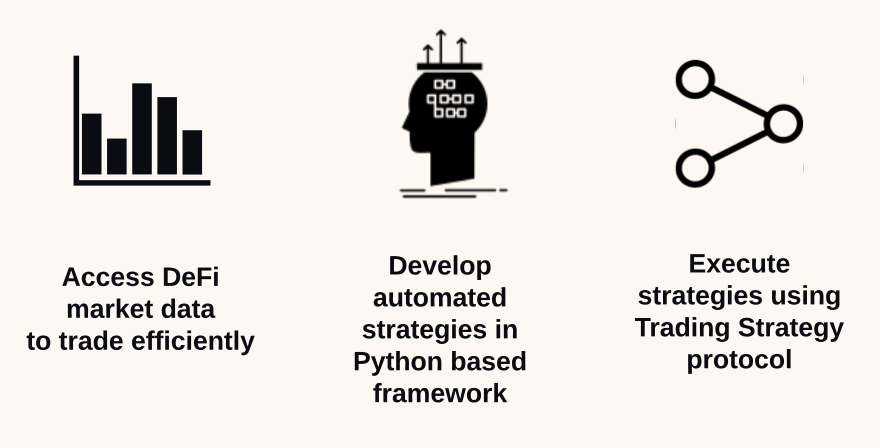

.. meta::
   :description: Trading Strategy technical documentation

Trading Strategy documentation
==============================

This is the technical documentation for Trading Strategy algorithmic trading framework and protocol.

The documentation is divided into three parts: overview, trading strategy development framework and trading strategy protocol.

.. _table of contents:

Table of contents
-----------------

.. toctree::
   :maxdepth: 1

   home
   getting-started
   overview/index
   programming/index
   architecture/index
   deployment/index
   protocol/index
   learn/index
   glossary

See also
--------

This is the landing page for the technical documentation.
Quick links to elsewhere:

- `Website <https://tradingstrategy.ai>`_
- `About Trading Strategy <https://tradingstrategy.ai/about>`_
- `Community Discord for questions <https://tradingstrategy.ai/community>`_
