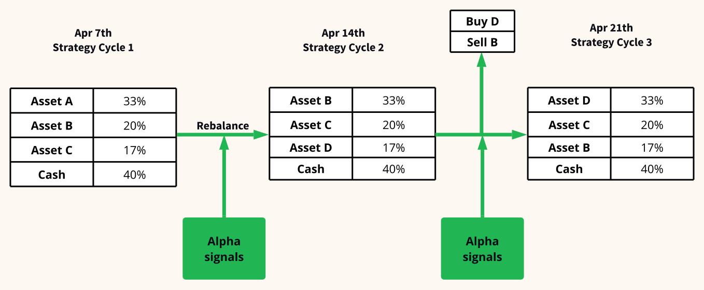
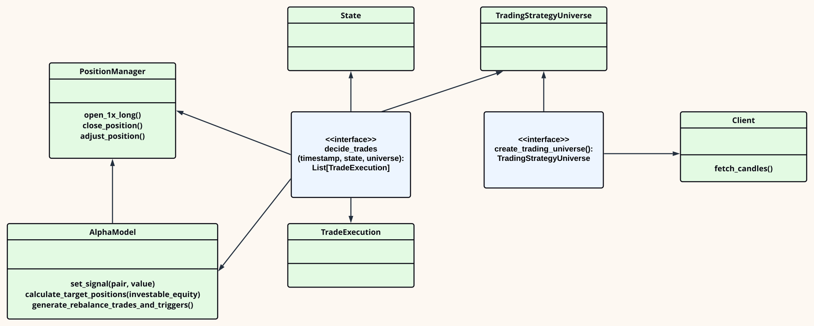
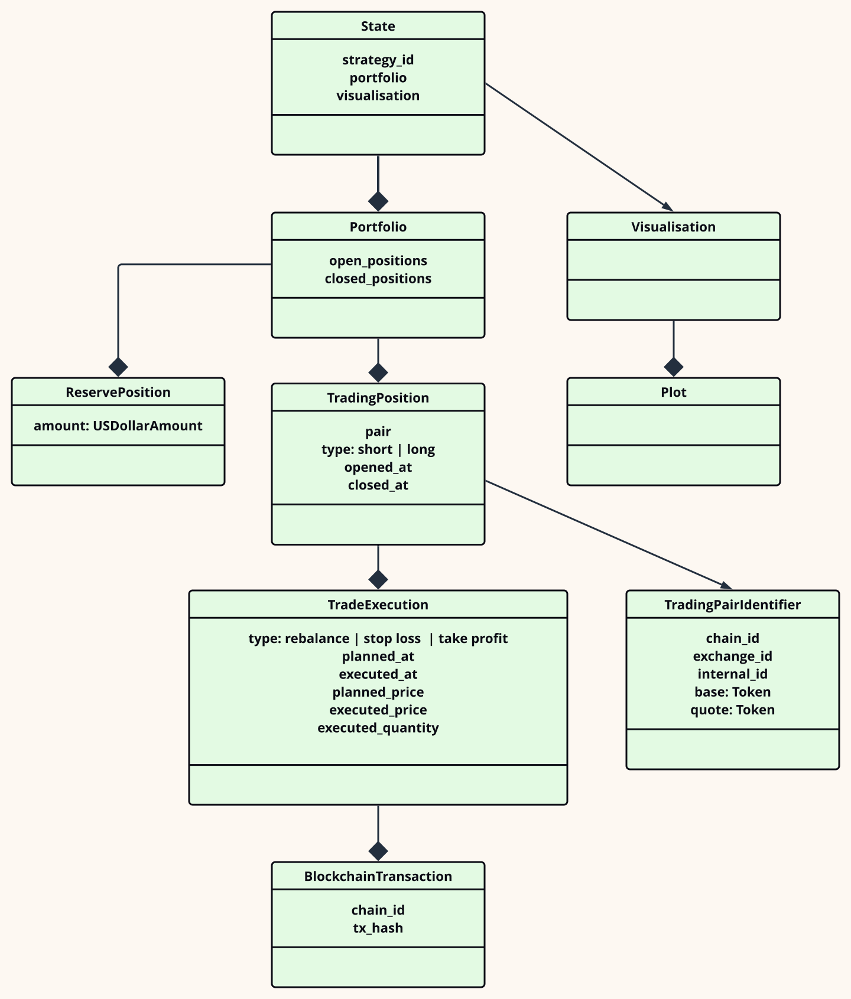
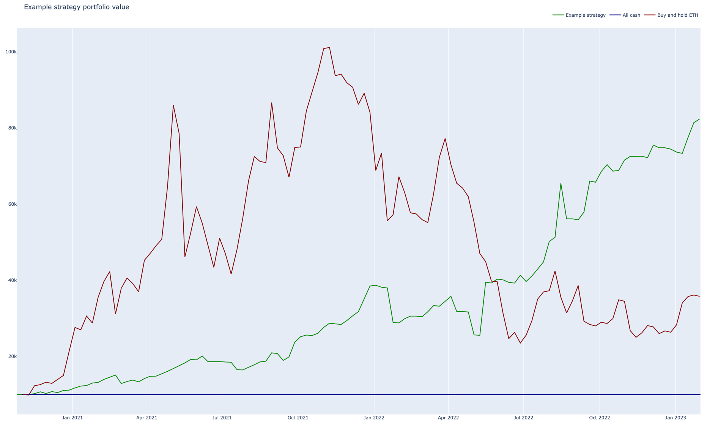
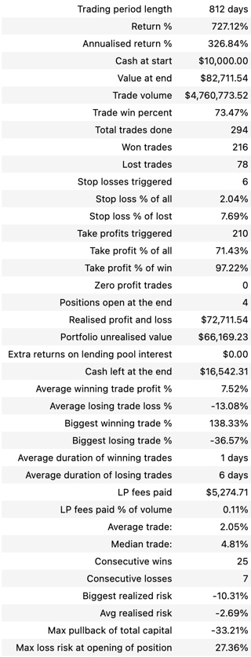
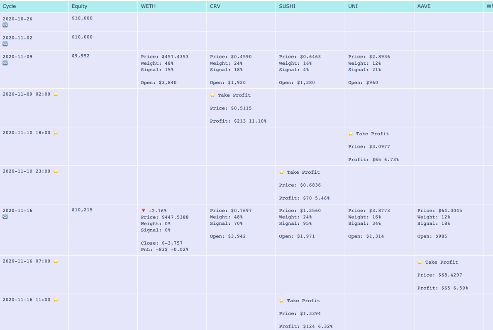

.. meta::
   :description: How to build alpha model strategies in Python

Developing portfolio construction trading strategies
====================================================

In this post, we will cover the basics of portfolio constructions and alpha models.
We will show how to build a simple portfolio construction strategy using Python and Trading Strategy's backtesting framework.

The target audience of this post us :term:`quants <quant>` and people who want to learn :term:`algorithmic trading`.

What is portfolio construction?
-------------------------------

Portfolio construction a :term:`trading strategy method <trading strategy>` of selecting securities optimally to achieve maximum returns while taking minimum risk.

It involves understanding how different asset classes, funds, and weightings impact each other and an investor's objectives

Portfolio construction has several phases

- **Asset allocation models** - to determine the optimal mix of asset classes (stocks, bonds, and commodities) in a portfolio, based on historical returns, volatility, and correlations.

- **Optimization techniques** - to identify the best combination of individual securities within each asset class, based on factors such as expected return, risk, and liquidity.

- **Risk management tools** - such as :term:`stop-loss orders <stop loss>`, hedging strategies, and diversification techniques, to manage portfolio risk and reduce exposure to individual assets or market risks

- **Alpha generation strategies** - :term:`so called alpha models <alpha model>` may include different kind of :term:`trading strategies <trading strategy>` such as :term:`factor investing`, :term:`statistical arbitrage`, and :term:`trend-following`, to identify assets and ways to trade them that are to outperform or underperform the broader market.

How does portfolio construction work?
-------------------------------------

Portfolio construction works by :term:`rebalancing <rebalance>` the portfolio assets based on the new allocation.
Rebalance usually occurs during a fixed intervals like weekly. The total equity (assets + cash)
is redeployed - assets receiving less weight are sold, while those that have a stronger alpha signal are bought.
:term:`The indivual percent weight of an asset <weight allocation>` is decided by some optimisation and risk management criteria.

What is Alpha model?
--------------------

An alpha model is a mathematical or quantitative framework used to generate trading signals that can be used in :term:`portfolio construction`.

The alpha model seeks to identify assets that are likely to outperform or underperform their peers, based on a variety of factors and variables.

Alpha models can be constructed using a variety of techniques, such as statistical analysis, machine learning algorithms, or financial modeling. The inputs to an alpha model may include company financial statements, price and volume data, macroeconomic indicators, and other market data.

Once an alpha model generates :term:`trading signals <alpha signal>`, the portfolio manager can use those signals to construct a portfolio that aims to generate alpha (i.e., excess returns) relative to a benchmark index.

What is Trading Strategy Framework?
-----------------------------------

The Trading Strategy Framework is a :term:`Python`-based software development framework
to develop :term:`automated trading strategies <automated trading strategy>` for :term:`decentralised finance`
markets.

The framework consists of

- Market data feed reader in the form of :term:`Trading Strategy Client`

- :term:`Backtesting framework <backtest>`

- :ref:`Live trade execution environment <strategy-deployment>` for decentralised markets

The core audience of the library is :term:`quants <quant>`.

How does Trading Strategy framework support creating portfolio constructions strategies?
----------------------------------------------------------------------------------------

The Trading Strategy Framework provides functionality for

- Setting up a tradeable asset universe from assets traded on :term:`decentralised finance markets <decentralised finance>`

- Writing a :term:`trading strategy` logic using a well-formed interface that transforms
  input data to trades

- Supports :term:`alpha model` that allows easily writing strategies for portfolio construction

The workflow for the framework is

- Develop and :term:`backtest` your strategies using :term:`Jupyter Notebook`

- Visualise and analyse the performance of your trading strategy using various tools
  and methods, like performance summary statistics, :term:`equity curve`, tracking the performance of
  individual positions

- Take your trading strategy backtested code unmodified to the live trading execution environment

The strategy core logic
-----------------------

The Trading Strategy Framework offers two functions the developer must implement for the strategies

- `creating_trading_universe()` that returns an object that represents all assets the strategy can trade.
  This data is used to set up and update backtesting and live market data feeds. This includes
  blockchains, exchanges, trading pairs, :term:`OHLCV` data feeds, liquidity data feeds and some
  special data feeds e.g. used for :term:`stop loss` triggers.

- `decide_trades()` takes in the current :term:`strategy cycle`, timestamped
  trading universe and the current strategy state (open positions) as an input.
  Based on this data the function will return a list of new trades that will either open new or close
  existing :term:`positions <position>`

The strategy advanced in ticks. Each tick length is the duration of a :term:`strategy cycle`.
Common strategy cycles includes hourly, daily and weekly trade decisions.
In the portfolio construction, this strategy cycle is called :term:`rebalance`.

Overview of portfolio construction strategy architecture
--------------------------------------------------------

The Trading Strategy framework offers a Python "lego blocks" that allows you to easily
put together a strategy without need to develop the software plumbinb yourself.

For a develop, this is seen as a high-level Python classes and objects.

- `decide_trades()` and `create_trading_universe()` are interface functions that the strategy developer
  fills in

- `timestamp` is the current strategy cycle tick of the trading strategy.

- Trading pairs are identified with a copy-by-value class :py:class:`tradeexecutor.state.identifier.TradingPairIdentifier`
  that encapsulates blockchain id, exchange id, :term:`ERC-20 tokens <ERC-20>` and their smart contract addresses which all are needed
  to uniquely refer to trading pairs in decentralised markets environments. This is one of the core challenges in decentralised markets,
  as assets cannot be simple referred by their three or four letter stock tickers.

- :py:class:`tradeexecutor.strategy.trading_strategy_universe.TradingStrategyUniverse` contains all data that can go input to the trade.

- :py:class:`tradeexecutor.state.state.State` contains all past and current data about the previous actions the strategy took,
  like opened and closed positions, trades, blockchain transaction execution details,
  technical indicators, uptime, deposited capital.

- :py:class:`tradeexecutor.strategy.alpha_model.AlphaModel` offers a way to set weighted :term:`trading signals <alpha signal>` based
  on the data analysis. It has helper methods of trackign signals, choosing top signals,
  and generating :term:`rebalance` trades automatically.

- :py:class:`tradeexecutor.strategy.pandas_trader.position_manager.PositionManager` is a high level utility class that is used to generate trades.
  For example, you can call `PositionManager.close_all` and it will return a list of trade orders
  that need to be executed in order to sell all assets and go back to fully cash.

Here is how `decide_trades()` interacts in the case of a portfolio construction strategy:

State is a :term:`JSON-serialisable <JSON>` hierarchy of all strategy persistent of objects.

The overview of a state management:

An example portfolio constructions strategy in Python
-----------------------------------------------------

Below is a Python strategy code for an example portfolio construction strategy.
It is based on fictional strategy that would trade a fixed set of :term:`decentralised finance`
assets across given set of exchanges and trading pairs.

For this particular example

- Runs a portfolio construction strategy backtest for a :term:`momentum` strategy
    - Uses handpicked "DeFi bluechip tokens" - see *Trading universe definition* for the list
    - Long only
    - Pick top assetes for each strategy cycle
    - Trade across multiple blockchains
    - Trade across multiple DEXes
    - Based on momentum (previous week price change %)
    - Weekly rebalances
    - Due to volatile cryptocurrency markets, uses take profit/stop loss triggers to manage risks and exit outside the normal rebalance cycle
    - Ignore price impact, and thus may cause unrealistic results
    - Ignore available liquidity to trade, and thus may cause unrealistic results
    - Ignore any complications of trading assets cross chain - we assume our reserve currency USDC is good on any chain and DEX and trading pair,
      which is not a realistic assumption
- Order routing is ignored; the strategy cannot be moved to live trading as is
    - We use the oldest available DEX price data we have: Uniswap v2, others
    - For live trade execution, one would want to choose execution on a newer DEX with less fees

`You can read the full backtesting Jupyter Notebook in Trading Strategy documentation <https://tradingstrategy.ai/docs/programming/strategy-examples/portfolio-construction-model.html>`__.

First we define our strategy backtest paramaters:

.. code-block:: python

    import datetime
    import pandas as pd

    from tradingstrategy.chain import ChainId
    from tradingstrategy.timebucket import TimeBucket
    from tradeexecutor.strategy.cycle import CycleDuration
    from tradeexecutor.strategy.strategy_module import StrategyType, TradeRouting, ReserveCurrency

    # Tell what trade execution engine version this strategy needs to use
    trading_strategy_engine_version = "0.1"

    # What kind of strategy we are running.
    # This tells we are going to use
    trading_strategy_type = StrategyType.managed_positions

    # How our trades are routed.
    # PancakeSwap basic routing supports two way trades with BUSD
    # and three way trades with BUSD-BNB hop.
    trade_routing = TradeRouting.ignore

    # Set cycle to 7 days and look back the momentum of the previous candle
    trading_strategy_cycle = CycleDuration.cycle_7d
    momentum_lookback_period = datetime.timedelta(days=7)

    # Hold top 3 coins for every cycle
    max_assets_in_portfolio = 4

    # Leave 20% cash buffer
    value_allocated_to_positions = 0.80

    # Set 33% stop loss over mid price
    stop_loss = 0.66

    # Set 5% take profit over mid price
    take_profit = 1.05

    # The weekly price must be up 2.5% for us to take a long position
    minimum_mometum_threshold = 0.025

    # Don't bother with trades that would move position
    # less than 300 USD
    minimum_rebalance_trade_threshold = 300

    # Use hourly candles to trigger the stop loss
    stop_loss_data_granularity = TimeBucket.h1

    # Strategy keeps its cash in USDC
    reserve_currency = ReserveCurrency.usdc

    # The duration of the backtesting period
    start_at = datetime.datetime(2020, 11, 1)
    end_at = datetime.datetime(2023, 1, 31)

    # Start with 10,000 USD
    initial_deposit = 10_000

Then we define our trading universe:

.. code-block:: python

    from tradingstrategy.client import Client

    from tradeexecutor.strategy.trading_strategy_universe import TradingStrategyUniverse
    from tradeexecutor.strategy.trading_strategy_universe import load_partial_data
    from tradeexecutor.strategy.execution_context import ExecutionContext
    from tradeexecutor.strategy.execution_context import ExecutionMode
    from tradeexecutor.strategy.universe_model import UniverseOptions

    # List of trading pairs that we consider "DeFi blueschips" for this strategy
    # For token ordering, wrappign see https://tradingstrategy.ai/docs/programming/market-data/trading-pairs.html
    pairs = (
        (ChainId.ethereum, "uniswap-v2", "WETH", "USDC"),  # ETH
        (ChainId.ethereum, "sushi", "AAVE", "WETH"),  # AAVE
        (ChainId.ethereum, "uniswap-v2", "UNI", "WETH"),  # UNI
        (ChainId.ethereum, "uniswap-v2", "CRV", "WETH"),  # Curve
        (ChainId.ethereum, "sushi", "SUSHI", "WETH"),  # Sushi
        (ChainId.bsc, "pancakeswap-v2", "WBNB", "BUSD"),  # BNB
        (ChainId.bsc, "pancakeswap-v2", "Cake", "BUSD"),  # Cake
        (ChainId.polygon, "quickswap", "WMATIC", "USDC"),  # Matic
        (ChainId.avalanche, "trader-joe", "WAVAX", "USDC"),  # Avax
        (ChainId.avalanche, "trader-joe", "JOE", "WAVAX"),  # TraderJoe
    )

    def create_trading_universe(
            ts: datetime.datetime,
            client: Client,
            execution_context: ExecutionContext,
            universe_options: UniverseOptions,
    ) -> TradingStrategyUniverse:

        assert not execution_context.mode.is_live_trading(), \
            f"Only strategy backtesting supported, got {execution_context.mode}"

        # Load data for our trading pair whitelist
        dataset = load_partial_data(
            client=client,
            time_bucket=trading_strategy_cycle.to_timebucket(),
            pairs=pairs,
            execution_context=execution_context,
            universe_options=universe_options,
            liquidity=False,
            stop_loss_time_bucket=stop_loss_data_granularity,
            start_at=start_at,
            end_at=end_at,
        )

        # Filter down the dataset to the pairs we specified
        universe = TradingStrategyUniverse.create_multichain_universe_by_pair_descriptions(
            dataset,
            pairs,
            reserve_token_symbol="USDC"  # Pick any USDC - does not matter as we do not route
        )

        return universe

And then we define the actual strategy in `decide_trades()` function:

.. code-block:: python

    from typing import List, Dict, Counter

    from tradingstrategy.universe import Universe
    from tradeexecutor.strategy.trading_strategy_universe import translate_trading_pair
    from tradeexecutor.strategy.weighting import weight_by_1_slash_n
    from tradeexecutor.strategy.alpha_model import AlphaModel
    from tradeexecutor.state.trade import TradeExecution
    from tradeexecutor.strategy.pricing_model import PricingModel
    from tradeexecutor.strategy.pandas_trader.position_manager import PositionManager
    from tradeexecutor.state.state import State

    def decide_trades(
            timestamp: pd.Timestamp,
            universe: Universe,
            state: State,
            pricing_model: PricingModel,
            cycle_debug_data: Dict) -> List[TradeExecution]:

        # Create a position manager helper class that allows us easily to create
        # opening/closing trades for different positions
        position_manager = PositionManager(timestamp, universe, state, pricing_model)

        alpha_model = AlphaModel(timestamp)

        # Watch out for the inclusive range and include and avoid peeking in the future
        adjusted_timestamp = timestamp - pd.Timedelta(seconds=1)
        start = adjusted_timestamp - momentum_lookback_period - datetime.timedelta(seconds=1)
        end = adjusted_timestamp

        candle_universe = universe.candles
        pair_universe = universe.pairs

        # Get candle data for all candles, inclusive time range
        candle_data = candle_universe.iterate_samples_by_pair_range(start, end)

        # Iterate over all candles for all pairs in this timestamp (ts)
        for pair_id, pair_df in candle_data:

            # We should have candles for range start - end,
            # where end is the current strategy cycle timestamp
            # and start is one week before end.
            # Because of sparse data we may have 0, 1 or 2 candles
            first_candle = pair_df.iloc[0]
            last_candle = pair_df.iloc[-1]

            # How many candles we are going to evaluate
            candle_count = len(pair_df)

            assert last_candle["timestamp"] < timestamp, "Something wrong with the data - we should not be able to peek the candle of the current timestamp, but always use the previous candle"

            open = last_candle["open"]
            close = last_candle["close"]

            # DEXPair instance contains more data than internal TradingPairIdentifier
            # we use to store this pair across the strategy
            dex_pair = pair_universe.get_pair_by_id(pair_id)
            pair = translate_trading_pair(dex_pair)

            # We define momentum as how many % the trading pair price gained during
            # the momentum window
            momentum = (close - open) / open

            # This pair has not positive momentum,
            # we only buy when stuff goes up
            if momentum <= minimum_mometum_threshold:
                continue

            alpha_model.set_signal(
                pair,
                momentum,
                stop_loss=stop_loss,
                take_profit=take_profit,
            )

        # Select max_assets_in_portfolio assets in which we are going to invest
        # Calculate a weight for ecah asset in the portfolio using 1/N method based on the raw signal
        alpha_model.select_top_signals(max_assets_in_portfolio)
        alpha_model.assign_weights(method=weight_by_1_slash_n)
        alpha_model.normalise_weights()

        # Load in old weight for each trading pair signal,
        # so we can calculate the adjustment trade size
        alpha_model.update_old_weights(state.portfolio)

        # Calculate how much dollar value we want each individual position to be on this strategy cycle,
        # based on our total available equity
        portfolio = position_manager.get_current_portfolio()
        portfolio_target_value = portfolio.get_total_equity() * value_allocated_to_positions
        alpha_model.calculate_target_positions(portfolio_target_value)

        # Shift portfolio from current positions to target positions
        # determined by the alpha signals (momentum)
        trades = alpha_model.generate_rebalance_trades_and_triggers(
            position_manager,
            min_trade_threshold=minimum_rebalance_trade_threshold,  # Don't bother with trades under 300 USD
        )

        # Record alpha model state so we can later visualise our alpha model thinking better
        state.visualisation.add_calculations(timestamp, alpha_model.to_dict())

        return trades

Analysing the backtest results
------------------------------

The backtest results can be analysed in various way. Some of the analyses goals are

- To see if the strategy is profitable

- See if the strategy has performance issues in different market conditions

- See if the strategy has performance issues in different market conditions

.. note ::

        Past performance is not indicative of future results.

The :Trading Strategy Framework offers few analysis tools you can
use in Jupyter Notebooks out of the box. Here are some examples.

The :term:`equity curve` of the backtest results that compares the example strategy to "buy and hold ETH" index benchhmark:

Summary statistics:

Individual position timeline:

Further discussion
------------------

If you have questions or feedback, please join the
`Trading Strategy community Discord for discussion <https://tradingstrategy.ai/community>`__.

