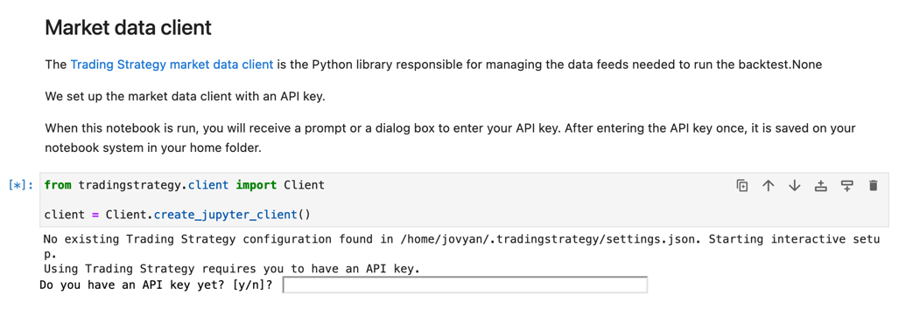

Binder development
==================

In this document, we show how to develop trading strategies using `Binder <https://mybinder.org/>`_ cloud based
:term:`Jupyter notebook` environment.

Preface
-------

Binder is free and popular software-as-a-service cloud environment
for running Jupyter Notebooks. Binder is an open source project
and supported by  Thanks to Google Cloud, OVH, GESIS Notebooks and the Turing Institute.

Limitations
-----------

.. note ::

    Binder cloud notebooks do not offer easy Save functionality.
    It is recommended that you use other methods for professional development.

Prerequisites
~~~~~~~~~~~~~

Prerequisites for developing trading strategies with Binder are

- Python programming basics

- :doc:`You have completed quick start tutorial <./code-examples/getting-started>`

- :doc:`You have read the backtest template notebook with its instructions <./strategy-examples/strategy-backtest-template>`

Opening the template
--------------------

Go to :doc:`strategy backtest template in the documentation <./strategy-examples/strategy-backtest-template>`

Press *Launch Binder* at the top of the page.

This will create a new Binder instance for you for editing and running the notebook.

The launch of a new Binder instance may take up to couple of minutes.

Run
---

Press *Restart kernel and run all cells* to execute the template notebook.

.. image:: binder-run.png

You will be prompted to enter Trading Strategy API key:

After this you will see the notebook downloading the OHLCV data to run backtest.

.. image:: binder-download.png

Saving changes
--------------

Binder instances are created on-demand and will erase themselves after a timeout.

To save your changes, you need to download Jupyter Notebook .ipynb file to your local computer.

.. note ::

    Binder is not ideal for long term development because difficult edit save workflow.
    Consider other options for professional development.

Technical information
---------------------

`Binder environment is configured in this Github repository <https://github.com/tradingstrategy-ai/binder-env>`_.

