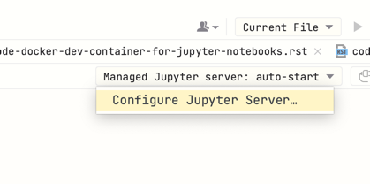
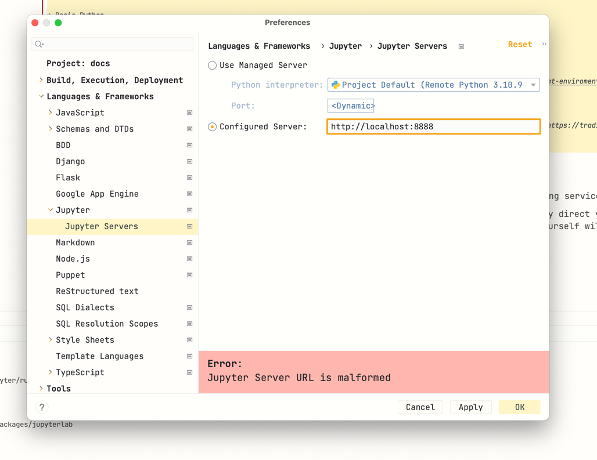
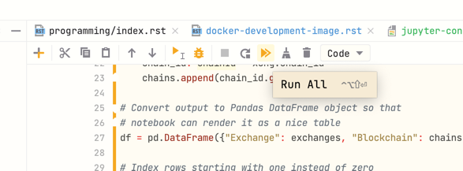
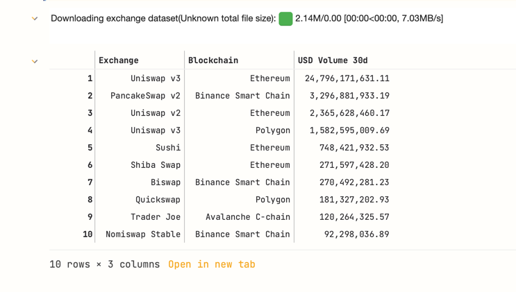
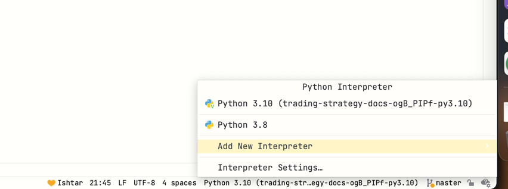
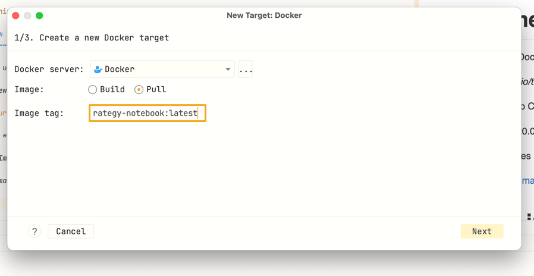
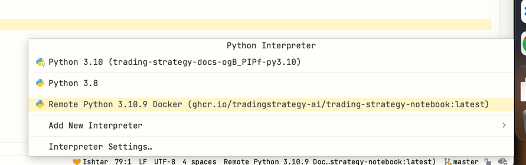

.. _Docker development image:

.. meta::
   :description: This option allows you to develop Trading Strategy notebooks and backtests using Docker based set up.

Docker development image
=========================

This option allows you to develop Trading Strategy notebooks and backtests
using Docker based set up.

Preface
-------

The Docker development image option is similar to :ref:`local Python` installation
and :ref:`Dev Container`.

* Download and run a development image using `docker` command

* Configure your IDE or other tooling to use Python interpreter
  and Jupyter Kernel inside Docker image

* The development image option might be more suitable for Microsoft Windows
  users due to `deficiencies in Microsoft Windows native development tooling <https://www.devever.net/~hl/windowsdefeat>`__

* Is currently available for `linux/amd64` architecture - for serious
  Apple M1 and M2 based development work we recommend :ref:`local Python` installation
  if the code execution speed becomes an issue

* Integrates very well with PyCharm IDE

Prerequisites
-------------

* You are familiar with Docker based development and have installed Docker for Desktop
  or similar for your local computer

Development image contents
--------------------------

The Trading Strategy Docker development image:

- Is tagged as `ghcr.io/tradingstrategy-ai/trading-strategy-notebook:latest`

- Is hosted at Github Container Registry (ghcr.io)

- Runs on Ubuntu 20.04 LTS

- Comes with binaries prepackaged, same as :ref:`local Python` installation

- `Dockerfile for the image <https://github.com/tradingstrategy-ai/trade-executor/blob/master/notebook.dockerfile>`__

- `See the Github repositry for the development image <https://github.com/tradingstrategy-ai/trading-strategy-notebook>`__

PyCharm instructions
--------------------

These instructions tell how to use the Docker development image with PyCharm

* Running example notebooks

* Configuring remote Jupyter kernel and Python interpreter

.. note ::

    `This functionality is only available on PyCharm Professional <https://www.jetbrains.com/help/pycharm/using-docker-as-a-remote-interpreter.html>`__.

Start a new project
~~~~~~~~~~~~~~~~~~~

Start a new PyCharm Python project.

It does not matter what options you choose in this point.

Getting example notebooks
~~~~~~~~~~~~~~~~~~~~~~~~~

To get the access to the example notebooks,
you need to `clone the documentation repository <https://github.com/tradingstrategy-ai/docs>`__ within your project.

The command line checkout for the `docs` folder is:

.. code-block:: shell

    git clone https://github.com/tradingstrategy-ai/docs.git

You can find examples in `docs/programming/code-examples` and `docs/programming/strategy-examples`.

Lauching Docker based Jupyter kernel
~~~~~~~~~~~~~~~~~~~~~~~~~~~~~~~~~~~~

To launch a Jupyter server you can open Terminal and enter:

.. code-block:: shell

    docker run \
        --platform linux/amd64 \
         -p 127.0.0.1:7777:7777/tcp \
        ghcr.io/tradingstrategy-ai/trading-strategy-notebook:latest \
        jupyter server \
        --ip "*" \
        --port 7777 \
        --allow-root

When the server starts you need to copy its token URL from the console output:

.. code-block:: text

    To access the server, open this file in a browser:
        file:///root/.local/share/jupyter/runtime/jpserver-1-open.html
    Or copy and paste one of these URLs:
        http://localhost:7777/?token=1b0a9224695f1397fe914c1ca6411dc4f2bb8ad29fb8a1bf
     or http://127.0.0.1:7777/?token=1b0a9224695f1397fe914c1ca6411dc4f2bb8ad29fb8a1bf

.. note ::

    We bind to port 7777, as PyCharm or something else might run its default server
    at localhost:8888. Also Jupyter Server is not designed to be run as a Docker,
    so we pass `--allow-root`

Adding remote Jupyter kernel
~~~~~~~~~~~~~~~~~~~~~~~~~~~~

Open `docs/programming/code-examples/getting-started.ipynb`.

Then paste the URL you received earlier from the console to *Configured server* in Jupyter configuration.

Then press *Run all*.

.. note ::

    When running Trading Strategy client enabled notebook for the first time,
    you will be interactively prompted for `Trading Strategy API key <https://tradingstrategy.ai/trading-view/backtesting>`__
    or a registration for it.

The example notebook should now run and display you the latest exchange volumes at the end of the notebook.

Add Docker based Python interpreter
~~~~~~~~~~~~~~~~~~~~~~~~~~~~~~~~~~~

You might need to add a remote interpreter to get code autocompletion
support for Jupyter notebooks.

.. note ::

    TODO: The needs for this stpe still confirmed with a fresh PyCharm setup.

This section is relevant if you want to run Python scripts, as opposite to notebooks,
using `trade-executor` interpreter in PyCharm.

To get up to the speed start by adding a new Python interpreter that is Docker based.

*Add new interpreter* is at the bottom right corner of PyCharm.

Choose *On Docker*.

Then *Image: pull*.

For *Image* enter `ghcr.io/tradingstrategy-ai/trading-strategy-notebook:latest`

Click through the installation wizard.

Thw new Python interpreter will show up as a remote interpreter.

Troubleshooting
---------------

If you get port bind errors check if you are already running containers.

.. code-block:: shell

    docker ps

.. code-block:: text

    CONTAINER ID   IMAGE                                                         COMMAND                  CREATED          STATUS          PORTS                      NAMES
    57c4c6c9a7ae   ghcr.io/tradingstrategy-ai/trading-strategy-notebook:latest   "jupyter server --al…"   44 seconds ago   Up 43 seconds   127.0.0.1:7777->8888/tcp   pedantic_swirles
    f9f402ebc39e   ghcr.io/tradingstrategy-ai/trading-strategy-notebook:latest   "jupyter server --al…"   11 minutes ago   Up 11 minutes   127.0.0.1:8888->8888/tcp   cool_spence

Then kill them with `docker rm`:

.. code-block:: shell

    docker rm -f 57c4c6c9a7ae

Next steps
----------

See :ref:`code examples <tutorial>`.

