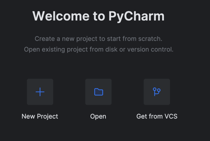
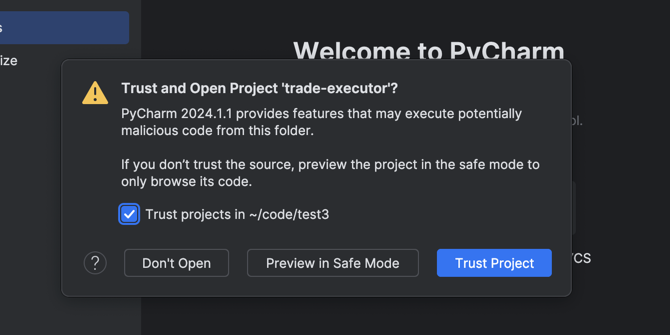
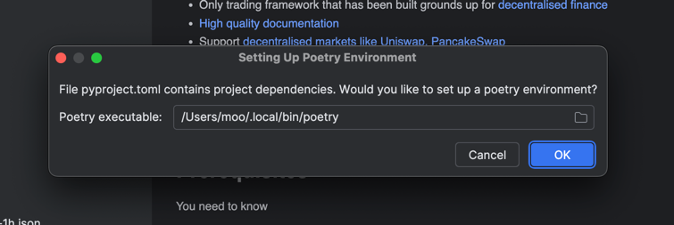
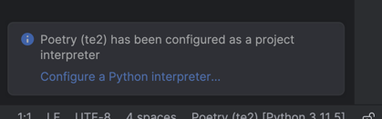
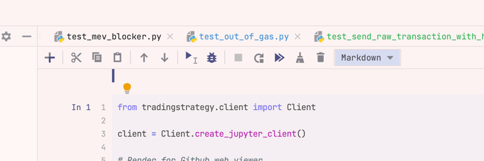
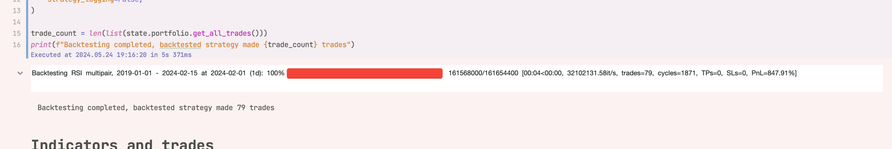
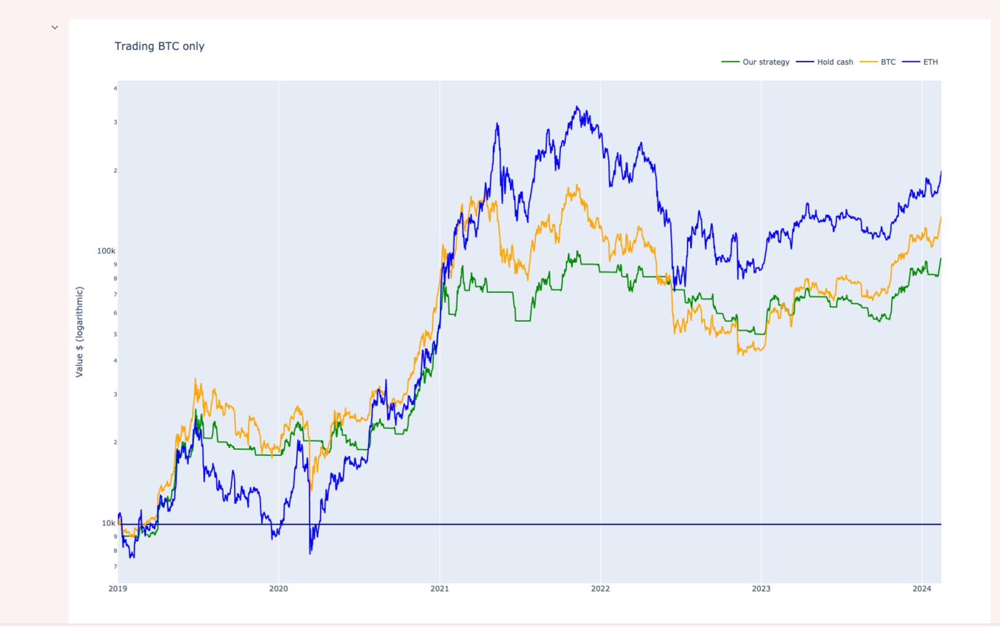

gi.. meta ::
    :description: Developing algorithmic trading in PyCharm
    :title: Setting up Trading Strategy development in PyCharm

=======
PyCharm
=======

This document describes how to set up :term:`Trading Strategy` development environment in PyCharm.

- We will use Poetry to install Python packages
- After the installation you will have a virtual environment you add to PyCharm

.. note ::

    PyCharm Professional is needed. PyCharm Community Edition does not support running notebooks.
    You can get a free 1 month trial for PyCharm Professional if needed.

Prerequisites
-------------

You need to be

- Understand Python package development basics
- Familiar with UNIX shell
- Familiar with PyCharm
- Familiar with Git
- Use Linux, macOS or Windows Subsystem for Linux

PyCharm is the most complicatd development environment to set up.
Unless you have Python experience, we recommend :ref:`to check the other options instead <Setting up development environment>`.

Python
------

Install Python. Check `README for the latest supported versions <https://github.com/tradingstrategy-ai/trade-executor/>`__.
Other versions won't work.

We do not cover how to set a correct Python version here.
We recommend `PyEnv <https://github.com/pyenv/pyenv>`__.

Codebase
--------

We do a local Git checkout, so you get all source code in the editable format,
as this installation method is aimed for the advanced users.

Check out the codebase to a new local directory:

.. code-block:: shell

    git clone --recurse-submodules git@github.com:tradingstrategy-ai/trade-executor.git

Create PyCharm project
----------------------

Choose Open Project and then pick the newly created `trade-executor` folder.

You need to trust it:

Using Poetry in PyCharm
-----------------------

After the project is open, PyCharm will automatically ask you if you wish to initialise the Poetry environment.

Choose ok.

It should also automatically pick the interpreter, but PyCharm allows to change the Python version
if this is not the case.

Running notebooks
-----------------

Now you can start working with backtest notebooks.

Copy-paste any `Getting started notebooks <https://github.com/tradingstrategy-ai/getting-started>`__ into your PyCharm.
Download file from the Github and then copy-paste the file into PyCharm project tree. Any folder is good.
We recommend starting with the first RSI example.

- There are many examples but only Getting started examples are maintained

Open the notebook file and press run (Double arrow).

When you run the notebook for the first time, it asks you to register for Trading Strategy API key.

You see a HTML progress bar when the notebook starts to download data and running backtests.

After running you see the result charts and tables in the end of the notebook.

.. note ::

    PyCharm Jupyter notebook runner is sometimes buggy with its output, especially with tables.
    We recommend contacting Jetbrains support and reporting any issues. Visual Studio Code
    is somewhat better what comes to editing Jupyter Notebooks. You can use both editors
    with the same installation.

Installing more packages
------------------------

You can go to the console and activate the virtual environment with Poetry:

.. code-block:: shell

    cd trade-executor
    poetry shell

Virtualenv is now activated in your UNIX shell.

Now you can install more packages with `poetry add` or `pip install`.

