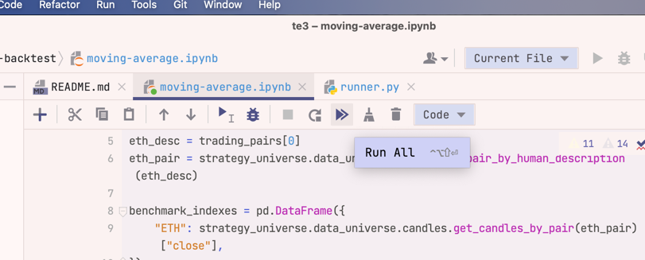

.. meta ::
    :description: Developing algorithmic trading in PyCharm
    :title: Setting up Trading Strategy development in PyCharm

=======
PyCharm
=======

This document describes how to set up :term:`Trading Strategy` development environment in PyCharm.

- We will use Poetry to install Python packages
- After the installation you will have a virtual environment you add to PyCharm

.. note ::

    PyCharm Professional is needed. PyCharm Community Edition does not support running notebooks.
    You can get a free 1 month trial for PyCharm Professional if needed.

Prerequisites
-------------

You need to be

- Understand Python package development basics
- Familiar with UNIX shell
- Familiar with PyCharm
- Familiar with Git
- Use Linux, macOS or Windows Subsystem for Linux

PyCharm is the most complicatd development environment to set up.
Unless you have Python experience, we recommend :ref:`to check the other options instead <Setting up development environment>`.

Python
------

Install Python. Check `README for the latest supported versions <https://github.com/tradingstrategy-ai/trade-executor/>`__.
Other versions won't work.

We do not cover how to set a correct Python version here.
We recommend `PyEnv <https://github.com/pyenv/pyenv>`__.

Codebase
--------

We do a local Git checkout, so you get all source code in the editable format,
as this installation method is aimed for the advanced users.

Check out the codebase to a new local directory:

.. code-block:: shell

    git clone --recurse-submodules git@github.com:tradingstrategy-ai/trade-executor.git

Create PyCharm project
----------------------

Choose Open Project and then pick the newly created `trade-executor` folder.

You need to trust it:

_ ..poetry-pycharm:

Using Poetry in PyCharm
-----------------------

**Wait until PyCharm finishes indexing the newly opened project**.
This may take up to a minute.

PyCharm will automatically ask you if you wish to initialise the Poetry environment.

Choose ok.

After a while you should get a PyCharm notification to *Configure a Python interpreter*:

**If you miss this notification there is Notifications tab bar on the right edge of PyCharm**.

Choose *Poetry interpreter*.

If you miss this you can also find the action **Python interpreter (Preferences > Project interpreter)** in
PyCharm command palette (activates with double clicking left shift).

After clicking this it allows to choose used Python installation in Project settings.

.. note ::

    If you have issues getting Python interpreter selected, see :ref:`pycharm-troubleshooting` below.

Running notebooks
-----------------

Now you can start working with backtest notebooks.

Copy-paste any `Getting started notebooks <https://github.com/tradingstrategy-ai/getting-started>`__ into your PyCharm.
Download file from the Github and then copy-paste the file into PyCharm project tree. Any folder is good.
We recommend starting with the first RSI example.

- There are many examples for Trading Strategy but only Getting started examples are maintained

- You can also add all Getting Strated examples to your PyCharm project by running a single `git clone` in the terminal:

.. code-block:: shell

    git clone https://github.com/tradingstrategy-ai/getting-started.git

Open the notebook file. Here we open `getting-started/notebooks/single-backtest/moving-average.ipynb`.

You need to mark the notebook **Trusted** or PyCharm may fail randomly.
PyCharm should prompt you for this, but sometimes it doesn't.

Press run (Double arrow).

When you run the notebook for the first time, it asks you to register for Trading Strategy API key.
Give your email, and then you will receive an API key in the email.

.. note ::

    `secret-token:` is part of the API, as per RFC 8595 and must be copy-pasted
    as the part of the API key.

You see a HTML progress bar when the notebook starts to download data and running backtests.

After running you see the result charts and tables in the end of the notebook.

.. note ::

    If you have issues see :ref:`pycharm-troubleshooting` below.

.. note ::

    PyCharm Jupyter notebook runner is sometimes buggy with its output, especially with tables.
    We recommend contacting Jetbrains support and reporting any issues. Visual Studio Code
    is somewhat better what comes to editing Jupyter Notebooks. You can use both editors
    with the same installation.

Installing more packages
------------------------

You can go to the console and activate the virtual environment with Poetry:

.. code-block:: shell

    cd trade-executor
    poetry shell

Virtualenv is now activated in your UNIX shell.

Now you can install more packages with `poetry add` or `pip install`.

.. _pycharm-troubleshooting:

Troubleshooting PyCharm and Jupyter Notebooks
---------------------------------------------

Here are some instructions to fix PyCharm Jupyter Notebook projects.

ImportError: No module tradingstrategy
~~~~~~~~~~~~~~~~~~~~~~~~~~~~~~~~~~~~~~

This means that PyCharm is trying to run the notebook with a wrong Python interpreter which
does not have `tradingstrategy` and other packges installed.

Confirm that you have a correct interpreter in PyCharm shell.

Open terminal.

.. code-block:: shell

    cd trade-executor
    poetry shell
    which python

    # Run this command manually if Poetry somehow failed to install earlier
    # poetry install

This displays the Python interpreter set up by PyCharm, like `/Users/moo/Library/Caches/pypoetry/virtualenvs/trade-executor-49eyUR2P-py3.11/bin/python`.

Copy this path.

Find the action **Python interpreter (Preferences > Project interpreter)** in
PyCharm command palette (activates with double clicking left shift).

After clicking this it allows to choose used Python installation in Project settings.

Choose *Add interpreter* > *Add local interpreter*.

Instead of *New*, choose *Existing* as we are adding an existing Poetry virtual environment.

Double click three dots (...) and paste in `python` path we copied earlier.

Now the notebooks should run when you choose this interpreter. See ref:`poetry-pycharm` for more details.

This is the Python that gets used when you run the notebook using the option what is called *Managed server*.

Notebook not running: Restarting Jupyter kernel
~~~~~~~~~~~~~~~~~~~~~~~~~~~~~~~~~~~~~~~~~~~~~~~

Sometimes the notebook just does not run even if press *Run* button on notebook toolbar.

Because Jupyter integration in PyCharm is very buggy, you sometimes need to manually restart Jupyter kernel
to make notebooks run again.

Choose *Jupyter* tab at the bottom of the screen (next to *Terminal*).

Press Stop button (Red square).

Now run notebook again.
