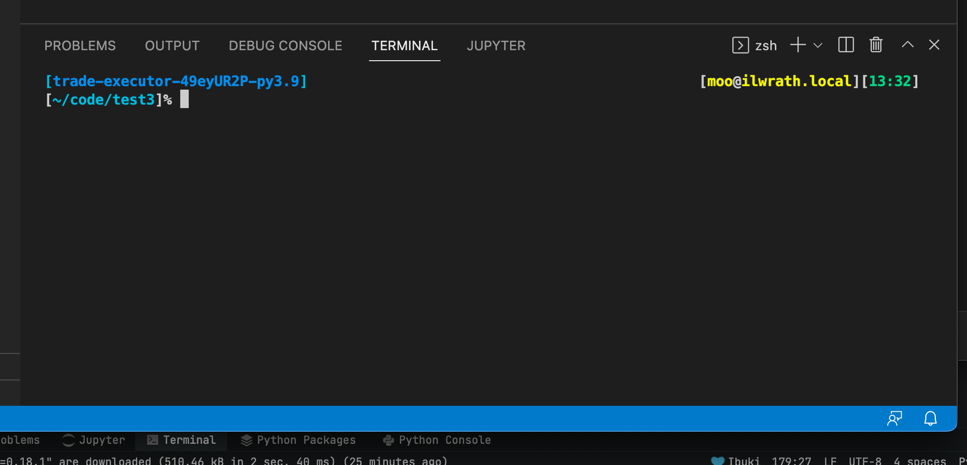
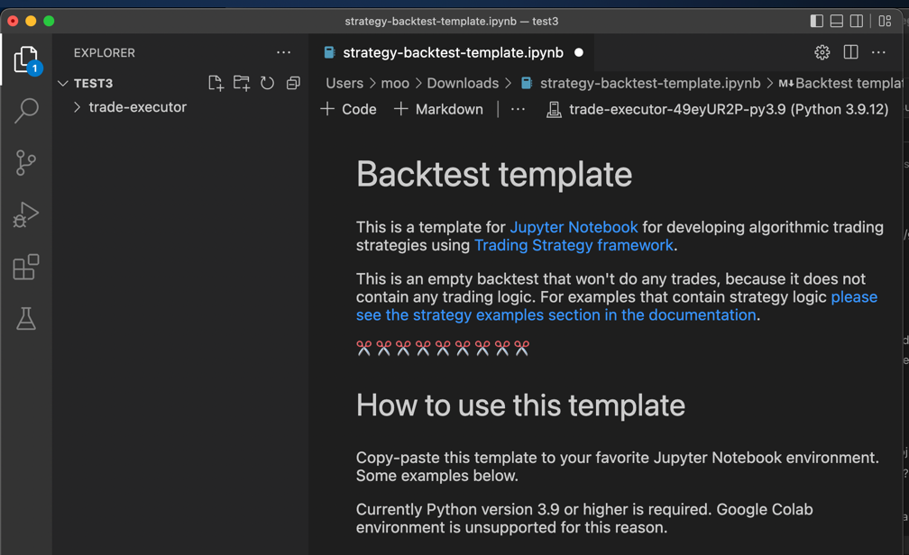
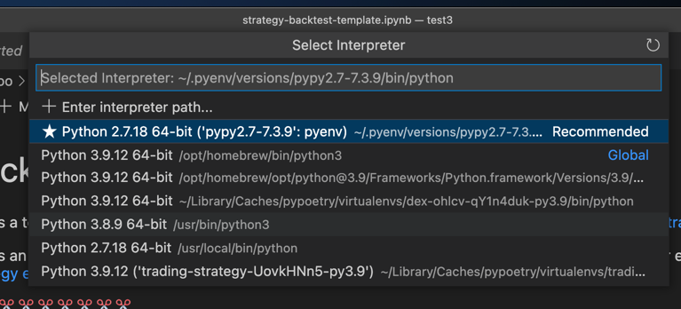
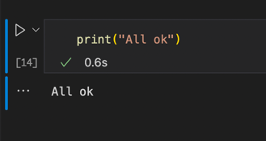
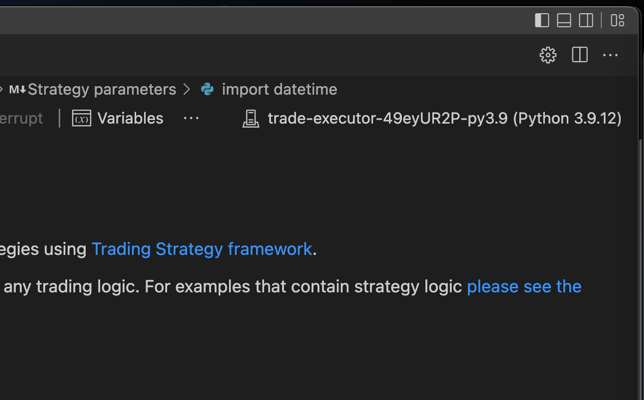

Visual Studio Code development
==============================

In this document, we show how to develop trading strategies using Visual Studio Code.

Preface
-------

`Visual Studio Code <https://code.visualstudio.com/>`__ is free and popular editor from Microsoft
for developing :term:`Jupyter Notebooks <Jupyter Notebook>`.

Using Visual Studio Code is recommended for development on your local laptop, unless
you know any other favorite Jupyter Notebook editors.

Prerequisites
~~~~~~~~~~~~~

Prerequisites for developing trading strategies with Visual Studio Code are:

- Python programming basics

- Command line usage basics

- Install Visual Studio Code, git, and Python locally

- :doc:`You have completed quick start tutorial <./code-examples/getting-started>`

- :doc:`You have read the backtest template notebook with its instructions <./strategy-examples/strategy-backtest-template>`

.. note::

    These instructions currently work 1:1 for macOS and Linux systems only.
    Microsoft Windows based installations need additional tools like Microsoft Visual Studio
    installed and are not yet covered in these instructions.

Install git
-----------

While the software is in beta, ``git`` command must be installed,
as we are using it to download code from Github.

`Install git <https://git-scm.com/downloads>`_.

Install Python
--------------

Python 3.10 or higher version is needed.

`Download and install Python <https://www.python.org/downloads/>`_.

Installing Visual Studio Code
-----------------------------

`Download and install Visual Studio Code <https://code.visualstudio.com/>`_.

Start Visual Studio Code.

- Install Python extension through *Extensions* view inside Visual Studio Code.

- Install Jupyter extension through *Extensions* view inside Visual Studio Code.

.. image:: vscode-python.png

Testing Python
--------------

In Visual Studio Code, open the terminal (*Terminal* > *New terminal*)

Check that your Python installation is configured

.. code-block:: shell

    python3

Should print

.. code-block::

    Python 3.9.12 (main, Mar 26 2022, 15:44:31)
    [Clang 13.1.6 (clang-1316.0.21.2)] on darwin
    Type "help", "copyright", "credits" or "license" for more information.

Use CTRL+D to exit.

Then try `git` commad on command line:

.. code-block:: shell

    git

Should print

.. code-block::

    usage: git [--version] [--help] [-C <path>] [-c <name>=<value>]

Now install `Poetry command <https://python-poetry.org/docs/#installation>`_ needed for the project installation:

.. code-block::

    curl -sSL https://install.python-poetry.org  | python3 -

Creating Python environment
---------------------------

Create an empty folder where you will place your backtesting workspace files.

Start Visual Studio Code. Go to *File* > *Open folder* and choose your newly created folder.

Open a terminal inside Visual Studio Code: *Terminal* > *New Terminal*.

Now we need to check out the source code tree using ``git`` to your workspace folder:

.. code-block:: shell

    git clone https://github.com/tradingstrategy-ai/trade-executor.git

Then we set up Python environment with ``trade-executor`` package installed:

.. code-block:: shell

    cd trade-executor
    git submodule update --init --recursive
    poetry shell
    poetry install

This should output:

.. code-block::

    Installing the current project: trade-executor (0.1.0)

Now Poetry has created a new Python environment with required packages for you.

You can find the Python environment ``python`` command location on your hard drive with the following command:

.. code-block:: shell

     poetry env info

This should output your *Virtualenv* where the Python packages are installed.

.. code-block:: shell

    Virtualenv
    Python:         3.9.12
    Implementation: CPython
    Path:           /Users/moo/Library/Caches/pypoetry/virtualenvs/trading-strategy-docs-jBbc2tTM-py3.9
    Valid:          True

Your Python intepreter path is the above path plus added ``/bin/python``.
E.g. in the above case this is:

.. code-block:: shell

     /Users/moo/Library/Caches/pypoetry/virtualenvs/trade-executor-49eyUR2P-py3.9/bin/python

You can test that Poetry installation works by running your Python interpreter now.
Copy-paste the full Python interpreter path to your Visual Studio Code terminal.
You will also need this path of the command later:

.. code-block:: shell

    /Users/moo/Library/Caches/pypoetry/virtualenvs/trade-executor-49eyUR2P-py3.9/bin/python

Then in Python prompt running:

.. code-block:: python

    import tradeexecutor

... should not give any errors.

Download strategy backtesting template
--------------------------------------

`Download the template Jupyter Notebook from Github <https://github.com/tradingstrategy-ai/docs/blob/master/source/programming/strategy-examples/strategy-backtest-template.ipynb>`__.

Save it in your workspace folder.

Open the notebook
-----------------

Use *File... Open* to open the template in Visual Studio Code.

Adding Python environment to Visual Studio Code
-----------------------------------------------

In Visual Studio Code, we need to tell the Visual Studio Code what Python environment to use for running the notebook.

Choose *View* > *Command palette*.

Type in to search for the command *Python: Select interpreter*.

Choose *Enter interpreter path*.

Copy-paste the Virtualenv path from ``poetry env`` output you did earlier.

For more information, see `configuring enviroments in Visual Studio Code and Python documentation by Microsoft <https://code.visualstudio.com/docs/python/environments>`__.

Run
---

Press *Run all* to execute the template notebook.

It will prompt you to choose a Python environment. Choose the one we just added.

- Visual Studio Code should ask for the Trading Strategy API key on the first run
- The run should complete with a checkmark on the last notebook cell

Troubleshooting
~~~~~~~~~~~~~~~

If you get an error:

.. code-block::

    ModuleNotFoundError: No module named 'tradeexecutor'

It means Visual Studio Code is not picking the Python environment where we installed
the ``trade-executor`` package.

Make sure that Visual Studio code is displaying the correct Python interpreter in the top right corner:

