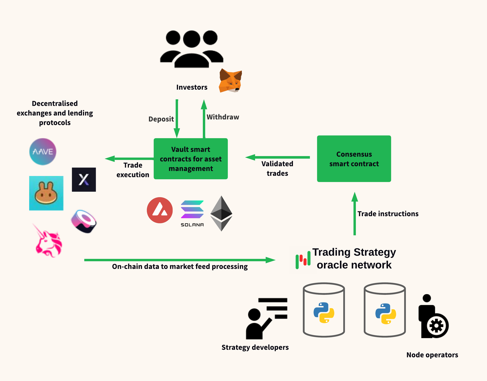

Overview
========

Algorithmic trading strategies can be deployed as :term:`autonomous agents <autonomous agent>` running on :term:`smart contracts <smart contract>` and Trading Strategy :term:`oracle` network. Strategies then trade on :term:`decentralised exchanges <decentralised exchange>`.

After deployed, investors can invest in and withdraw from the strategies
in real-time, using their :term:`non-custodial` cryptocurrency wallet.

As strategies run :term:`on-chain`, any third party can verify the honest execution of the strategies
and fee distribution.

Protocol stakeholders
---------------------

.. _investor:

Investors
~~~~~~~~~

Investors can deposit and withdraw into the different strategies based on their risk profile

- Strategies are listed based on their performance characters like assets traded,
  maximum drawdown and the strategy asset under management cap.

- Investors can choose a strategy suitable for their available asseta and risk apetite.

- Investors deposit and withdraw into a strategy in real-time, using a :term:`stablecoin` like
  :term:`USDC`.

- All strategies are :term:`non-custodial` based on :term:`vault` smart contracts.
  Investors can transact with the vault without any middleman.
  Each strategy has its own isolated vault for isolating any risk.

.. _strategy developer:

Strategy developers
~~~~~~~~~~~~~~~~~~~

Strategy developers are :term:`quantitative finance` experts who have deep inside
in :term:`defi` and :term:`decentralised exchange` markets.

- Strategy developers program new algorithmic trading strategies.

- Strategy developers are rewarded for the strategy creation e.g.
  with profit sharing fees from the strategy profits.

- In Trading Strategy protocol, strategy developers do not need to
  possess low-level blockchain or Solidity programming skills.
  Instead, strategies are written in high-level :term:`Python`
  scripts.

Node operators
~~~~~~~~~~~~~~

Node operators are the responsible for running :term:`oracles <oracle>` that
make the Trading Strategy protocol possible.

- Node operators are sufficiently decentralised entities,
  ensuring that the :term:`oracle` network stays honest.

- Node operators' core skillset is maintaining high-availability
  servers that process :term:`market data feeds <market data feed>`

- Node operators are paid for the running the oracle nodes
  as a staking rewards that come from the profit sharing of the strategies

Components of the protocol
--------------------------

.. _oracle:

Oracle
~~~~~~

An oracle is a server that forms a network node in Trading Strategy protocol network.
The Trading Strategy protocol network is made from multiple oracles.

Oracles process data off-chain, as opposite to :term:`on-chain` :term:`yield farming`
strategies. This gives oracles much more power to arrive to trade decisions.
An on-chain :term:`smart contract` can use around 4 kilobytes of data to make a decision,
whereas Trading Strategy oracles can process gigabytes of data per trade.

Oracles read raw data from :term:`on-chain` :term:`DeFi` services like
:term:`decentralised exchanges <decentralised exchange>`. Then, oracles
proces this data to :term:`market data feeds <market data feed>`,
like price time-series.

Unlike in other oracle networks, Trading Strategy oracle possess
intelligence and capacity to make complex calculations.
Instead of just feeding the price data, oracles also run :term:`strategies <strategy>`.
Oracles execute the trading strategies with market data feeds as input.
The strategies then generate trade instructions for entering or
exiting :term:`trade positions <position>`,

Oracles are :term:`deterministic`. Anyone can start a new oracle
and it will arrive to the same trade instructions based on the same
blockchain data fed to it. Thus, it is easy for new oracles
to join the protocol network and leave from it, without
causing interruptions for the protocol.

Decentralised exchange
~~~~~~~~~~~~~~~~~~~~~~

A :term:`decentralised exchange` is a venue where oracles trade.

All trading happens :term:`on-chain`.
Because oracles act as :term:`autonomous agents <autonomous agent>`
they cannot enter into a contract with a traditional finance entities.
All interaction with decentralised exchanges happens through
:term:`smart contracts <smart contract>`.

Popular decentralised exchanges include :term:`Uniswap`, PancakeSwap,
Serum, TraderJoe, DyDx, Perp.fi and SushiSwap.

Vault smart contract
~~~~~~~~~~~~~~~~~~~~

A :term:`vault` smart contract is responsible for managing segregated
investor assets.

- Each strategy has its own vault smart contract.
  Vault smart contracts are isolated from each other to isolate risk.

- Each investor has a stake in a strategy vault contract,
  in the form of share tokens.

- Share tokens are given to the investor when the investor deposits
  to the vault.

- Share tokens can be redeemed against the profits of a vault,
  and then the underlying principal withdrawn.

- Investors interaction happen only with the vault smart contract.
  There are no centralised services.

`EIP-4626 <https://eips.ethereum.org/EIPS/eip-4626>`_ is a popular
vault smart contract standard for :term:`EVM compatible` blockchains.

Consensus smart contract
~~~~~~~~~~~~~~~~~~~~~~~~

A consensus smart contract validates the trade instructions coming from the oracle network.

- Sufficiently decentralised oracle network ensures the high quality of the service
  and guaranteed transparency.

- Oracles run the code off-chain. Oracles need to reach a consensus on :term:`trade positions <position>`.
  For this, the results of oracle calculations and resulting trade instructions need to be verified :term:`on-chain`.
  Causes for the oracles disagreeing the results include :term:`market data feed` issues,
  downtime, malfunctioning or manipulation attempts.

- A simple majority rule is the simplest form of consensus.

- The consensus smart contract may punish misbehaving oracles by dropping their rewards.

Strategy
~~~~~~~~

A strategy is a :term:`Python` script that decides the trades.

- A trading strategy protocol can run multiple strategies, created by
  :ref:`strategy developers <strategy developer>`.

- Strategies are executed on the network of :ref:`oracle <oracle>` servers.

- A strategy can use the full power of :term:`Python` programming language, on powerful oracle servers.
  This may include machine learning and such novel AI concepts.

- Trading Strategy protocol comes with its own :ref:`framework` for creating strategies.

- Live trading strategies are fed with :term:`market data feeds <market data feed>`,
  but strategies can be :ref:`backtested <running-backtests>` against historical data.

- Strategies calculate different term:`technical indicators <technical indicator>` based
  on data feeds, like :term`OHLCV` :term:`price candles <candle>`. The main sources of indicators
  are price, volume and liquidity data, but alternative data sources like on-chain analytics
  and sentiment can be used as well.

- Strategies then make trading decisions to enter and exit :term:`positions <position>`.
  A strategy can trade a single trading pair like ETH/USD or have complex
  :term:`trading universe` of several thousands of assets for portfolio construction.

- Both backtested and live profit and risk performance allows :ref:`investors <investor>`
  to make decisions on which strategies they invest in.

If you are into Python and trading algorithm development yourself,
check out :ref:`strategy examples`.
